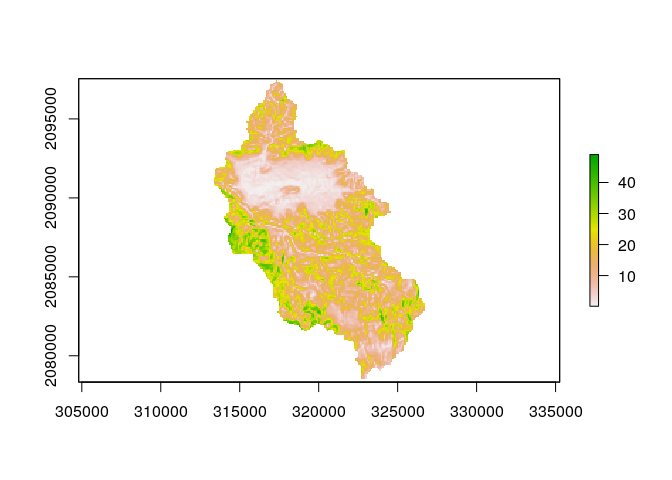

Explorar datos espaciales básicos entre GRASS y R
================

<!-- Este .md fue generado a partir del .Rmd homónimo. Edítese el .Rmd -->
<!-- ## Retomar región de GRASS GIS creada en pasos previos -->
Imprimir lista de mapas ráster y vectoriales dentro en la región/localización activa
------------------------------------------------------------------------------------

``` r
execGRASS(
  'g.list',
  flags = 't',
  parameters = list(
    type = c('raster', 'vector')
  )
)
## raster/dem
## vector/dem_extent
```

Cargar en R el DEM (mapa ráster)
--------------------------------

``` r
library(sp)
use_sp()
dem_sp <- readRAST('dem')
op <- par()
plot(dem_sp)
```


Cargar a R el mapa vectorial de una cuenca que se encuentra alojado fuera de GRASS, hacer el plot y representar la cuenca del arroyo Pantuflas superpuesta
----------------------------------------------------------------------------------------------------------------------------------------------------------

``` r
library(sf)
## Linking to GEOS 3.8.0, GDAL 3.0.4, PROJ 7.0.0
rutapantuflas <- 'data/cuenca_arroyo_pantuflas.geojson'
pantuflas <- st_read(rutapantuflas)
## Reading layer `cuenca_arroyo_pantuflas' from data source `/home/jr/unidad-4-asignacion-1-procesos-fluviales/data/cuenca_arroyo_pantuflas.geojson' using driver `GeoJSON'
## Simple feature collection with 1 feature and 1 field
## geometry type:  POLYGON
## dimension:      XY
## bbox:           xmin: 313165.5 ymin: 2078336 xmax: 326899.8 ymax: 2097546
## projected CRS:  WGS 84 / UTM zone 19N
plot(dem_sp)
plot(pantuflas, add=T, col='transparent', border='black', lwd=5);par(op[c('mfrow','mar')])
```


Analizar el DEM dentro de la cuenca del Pantuflas
-------------------------------------------------

``` r
library(raster)
dem_r0 <- raster(dem_sp)
dem_r1 <- crop(dem_r0, pantuflas)
dem_pant <- mask(dem_r1, pantuflas)
plot(dem_pant)
```


``` r
summary(dem_pant)
##               dem
## Min.     1055.431
## 1st Qu.  1280.646
## Median   1497.753
## 3rd Qu.  1826.496
## Max.     2626.607
## NA's    16893.000
hist(dem_pant)
```


Obtener variables de terreno básicas con el paquete `raster` dentro de R
------------------------------------------------------------------------

``` r
pend_pant <- terrain(x = dem_pant, opt = 'slope', unit = 'degrees')
plot(pend_pant)
```



``` r
summary(pend_pant)
##                slope
## Min.    1.176069e-01
## 1st Qu. 7.450233e+00
## Median  1.385959e+01
## 3rd Qu. 2.029122e+01
## Max.    4.899771e+01
## NA's    1.773000e+04
hist(pend_pant)
```


Obtener la misma variable de terreno con GRASS GIS
--------------------------------------------------

``` r
writeVECT(as_Spatial(pantuflas), 'pantuflas', v.in.ogr_flags='quiet')
execGRASS(
  "g.region",
  parameters=list(
    vector = "pantuflas"
  )
)
execGRASS(
  "r.mask",
  flags = c('verbose','overwrite','quiet'),
  parameters = list(
    vector = 'pantuflas'
  )
)
execGRASS(
  cmd = 'r.slope.aspect',
  flags = c('overwrite','quiet'),
  parameters = list(
    elevation='dem',
    slope='slope',
    aspect='aspect',
    pcurvature='pcurv',
    tcurvature='tcurv')
  )
pend_pant_g <- readRAST('slope')
```

``` r
plot(pend_pant_g);par(op[c('mfrow','mar')])
```


``` r
summary(pend_pant_g)
## Object of class SpatialGridDataFrame
## Coordinates:
##            min       max
## [1,]  313165.5  326899.8
## [2,] 2078335.6 2097545.6
## Is projected: TRUE 
## proj4string :
## [+proj=utm +no_defs +zone=19 +a=6378137 +rf=298.257223563
## +towgs84=0.000,0.000,0.000 +to_meter=1]
## Grid attributes:
##   cellcentre.offset cellsize cells.dim
## 1          313210.4 89.76646       153
## 2         2078380.4 89.76646       214
## Data attributes:
##      slope       
##  Min.   : 0.082  
##  1st Qu.: 7.539  
##  Median :13.889  
##  Mean   :14.405  
##  3rd Qu.:20.301  
##  Max.   :48.998  
##  NA's   :16894
summary(pend_pant)
##                slope
## Min.    1.176069e-01
## 1st Qu. 7.450233e+00
## Median  1.385959e+01
## 3rd Qu. 2.029122e+01
## Max.    4.899771e+01
## NA's    1.773000e+04
gmeta()
## gisdbase    /home/jr/unidad-4-asignacion-1-procesos-fluviales/grass-data-test 
## location    rdom 
## mapset      PERMANENT 
## rows        214 
## columns     153 
## north       2097546 
## south       2078336 
## west        313165.5 
## east        326899.8 
## nsres       89.76646 
## ewres       89.76646 
## projection  +proj=utm +no_defs +zone=19 +a=6378137 +rf=298.257223563
## +towgs84=0.000,0.000,0.000 +type=crs +to_meter=1
execGRASS(
  "g.region",
  parameters=list(
    raster = "dem"
  )
)
execGRASS(
  "r.mask",
  flags = c('r','quiet')
)
gmeta()
## gisdbase    /home/jr/unidad-4-asignacion-1-procesos-fluviales/grass-data-test 
## location    rdom 
## mapset      PERMANENT 
## rows        895 
## columns     975 
## north       2122949 
## south       2042609 
## west        253740.1 
## east        341262.4 
## nsres       89.76646 
## ewres       89.76646 
## projection  +proj=utm +no_defs +zone=19 +a=6378137 +rf=298.257223563
## +towgs84=0.000,0.000,0.000 +type=crs +to_meter=1
```

Limpiar archivo de bloqueo del conjunto de mapas de GRASS
---------------------------------------------------------

``` r
unlink_.gislock()
```

Referencias
-----------
