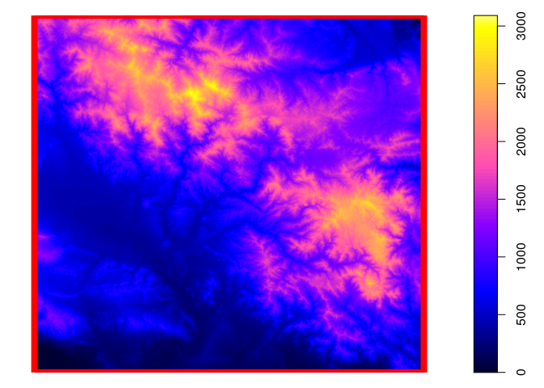

Explorar mapas de GRASS en R
================

<!-- Este .md fue generado a partir del .Rmd homónimo. Edítese el .Rmd -->
Cargar paquete, activar/crear región
------------------------------------

Más información en [Introducción a rgrass7, interfaz entre GRASS GIS 7 y R. Crear región de GRASS](intro-rgrass.md)

``` r
library(rgrass7)
## Loading required package: XML
## GRASS GIS interface loaded with GRASS version: (GRASS not running)
gisdbase <- 'grass-data-test' #Base de datos de GRASS GIS
wd <- getwd() #Directorio de trabajo
wd
## [1] "/home/jr/unidad-4-asignacion-1-procesos-fluviales/scripts-de-referencia"
loc <- initGRASS(gisBase = "/usr/lib/grass78/",
                 home = wd,
                 gisDbase = paste(wd, gisdbase, sep = '/'),
                 location = 'rdom',
                 mapset = "PERMANENT",
                 override = T
                 )
```

Imprimir lista de mapas ráster y vectoriales dentro en la región/localización activa
------------------------------------------------------------------------------------

``` r
execGRASS(
  'g.list',
  flags = 't',
  parameters = list(
    type = c('raster', 'vector')
  )
)
## raster/dem
## vector/dem_extent
```

Cargar un mapa ráster a R y visualizarlo
----------------------------------------

``` r
library(sp)
use_sp()
r <- readRAST('dem')
## Creating BIL support files...
## Exporting raster as floating values (bytes=4)
##    0%   3%   6%   9%  12%  15%  18%  21%  24%  27%  30%  33%  36%  39%  42%  45%  48%  51%  54%  57%  60%  63%  66%  69%  72%  75%  78%  81%  84%  87%  90%  93%  96%  99% 100%
v <- readVECT('dem_extent')
## Exporting 1 area (may take some time)...
##  100%
## v.out.ogr complete. 1 feature (Polygon type) written to <dem_extent> (GPKG
## format).
## OGR data source with driver: GPKG 
## Source: "/home/jr/unidad-4-asignacion-1-procesos-fluviales/scripts-de-referencia/grass-data-test/rdom/PERMANENT/.tmp/rstudio-ubuntu-s-1vcpu-2gb-nyc3-01/192.0.gpkg", layer: "dem_extent"
## with 1 features
## It has 11 fields
plot(r)
plot(v, add=T, border='red', lwd=8)
```



Limpiar archivo de bloqueo del conjunto de mapas de GRASS
---------------------------------------------------------

``` r
unlink_.gislock()
```

Referencias
-----------
