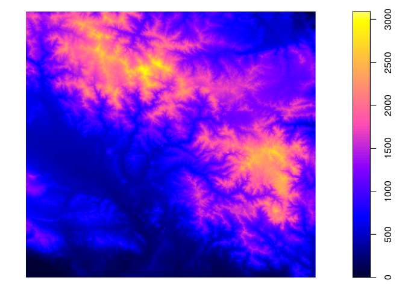
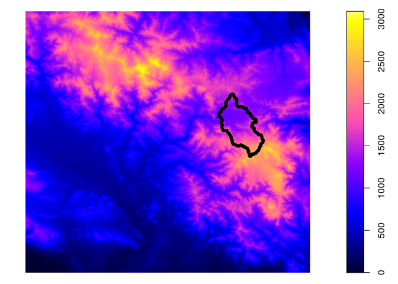
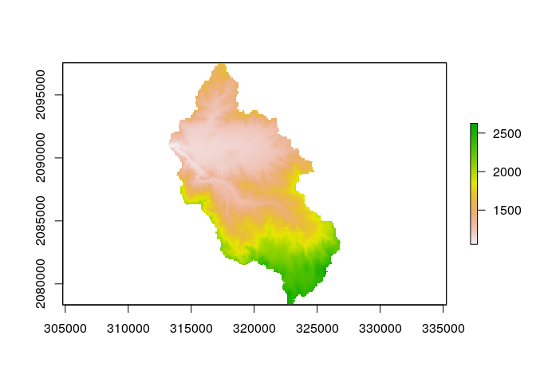
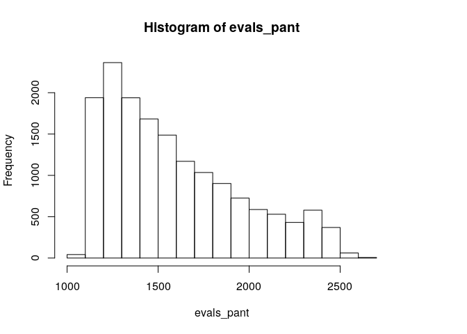
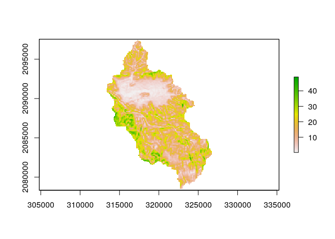
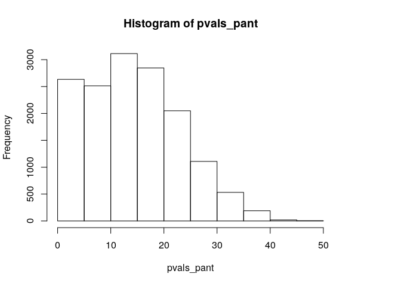

Explorar datos espaciales básicos entre GRASS y R
================

<!-- Este .md fue generado a partir del .Rmd homónimo. Edítese el .Rmd -->
<!-- ## Retomar región de GRASS GIS creada en pasos previos -->
Cargar paquete, activar región
------------------------------

Base de datos de GRASS GIS creada en el [paso previo](proyeccion-importar-fuente-extension.md)

``` r
library(rgrass7)
gisdbase <- 'grass-data-test'
wd <- getwd() #Directorio de trabajo
wd
## [1] "/home/jr/unidad-4-asignacion-1-procesos-fluviales/scripts-de-referencia"
loc <- initGRASS(gisBase = "/usr/lib/grass78/",
                 home = wd,
                 gisDbase = paste(wd, gisdbase, sep = '/'),
                 location = 'rdom',
                 mapset = "PERMANENT",
                 override = T
                 )
```

Imprimir lista de mapas ráster y vectoriales dentro en la región/localización activa
------------------------------------------------------------------------------------

``` r
execGRASS(
  'g.list',
  flags = 't',
  parameters = list(
    type = c('raster', 'vector')
  )
)
## raster/dem
## vector/dem_extent
```

Cargar en R el DEM (mapa ráster)
--------------------------------

``` r
library(sp)
use_sp()
dem_sp <- readRAST('dem')
## Creating BIL support files...
## Exporting raster as floating values (bytes=4)
##    0%   3%   6%   9%  12%  15%  18%  21%  24%  27%  30%  33%  36%  39%  42%  45%  48%  51%  54%  57%  60%  63%  66%  69%  72%  75%  78%  81%  84%  87%  90%  93%  96%  99% 100%
plot(dem_sp)
```



Cargar a R el mapa vectorial de una cuenca que se encuentra alojado fuera de GRASS, hacer el plot y representar la cuenca del arroyo Pantuflas superpuesta
----------------------------------------------------------------------------------------------------------------------------------------------------------

``` r
library(sf)
## Linking to GEOS 3.8.0, GDAL 3.0.4, PROJ 7.0.0
rutapantuflas <- 'data/cuenca_arroyo_pantuflas.geojson'
pantuflas <- st_read(rutapantuflas)
## Reading layer `cuenca_arroyo_pantuflas' from data source `/home/jr/unidad-4-asignacion-1-procesos-fluviales/data/cuenca_arroyo_pantuflas.geojson' using driver `GeoJSON'
## Simple feature collection with 1 feature and 1 field
## geometry type:  POLYGON
## dimension:      XY
## bbox:           xmin: 313165.5 ymin: 2078336 xmax: 326899.8 ymax: 2097546
## projected CRS:  WGS 84 / UTM zone 19N
plot(dem_sp)
plot(pantuflas, add=T, col='transparent', border='black', lwd=5)
```



Analizar el DEM dentro de la cuenca del Pantuflas
-------------------------------------------------

``` r
library(raster)
dem_r0 <- raster(dem_sp)
dem_r1 <- crop(dem_r0, pantuflas)
dem_pant <- mask(dem_r1, pantuflas)
plot(dem_pant)
```



``` r
evals_pant <- dem_pant[]
summary(na.omit(evals_pant))
##    Min. 1st Qu.  Median    Mean 3rd Qu.    Max. 
##    1055    1281    1498    1588    1826    2627
hist(evals_pant)
```



Obtener variables de terreno básicas
------------------------------------

``` r
pend_pant <- terrain(x = dem_pant, opt = 'slope', unit = 'degrees')
plot(pend_pant)
```



``` r
pvals_pant <- pend_pant[]
summary(na.omit(pvals_pant))
##    Min. 1st Qu.  Median    Mean 3rd Qu.    Max. 
##  0.1176  7.4502 13.8596 14.3763 20.2912 48.9977
hist(pvals_pant)
```



Limpiar archivo de bloqueo del conjunto de mapas de GRASS
---------------------------------------------------------

``` r
unlink_.gislock()
```

Referencias
-----------
