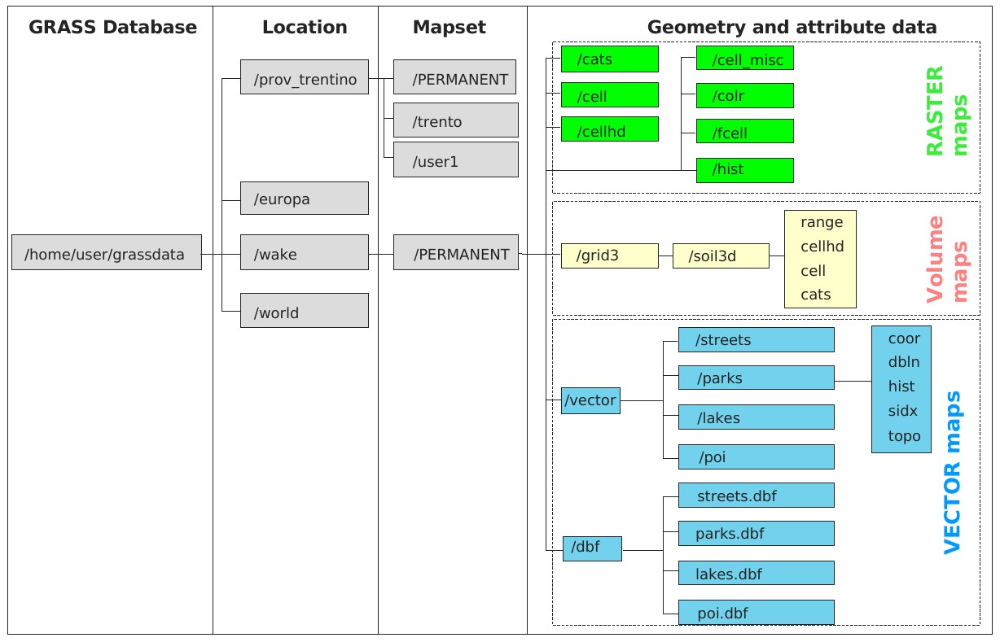

Crear una región de GRASS GIS desde R usando el paquete rgrass7
================

Paquetes
--------

Sólo necesitamos el paquete `rgrass7` (R. Bivand, Krug, Neteler, Jeworutzki, & Bivand, 2019)

``` r
library(rgrass7)
## Loading required package: XML
## GRASS GIS interface loaded with GRASS version: (GRASS not running)
```

Región de GRASS
---------------

 Organización de directorio, localidad, conjuntos de mapas, capas vectoriales y ráster, según M. Neteler & Mitasova (2007)

``` r
gisdbase <- 'grass-data-test' #Base de datos de GRASS GIS
wd <- getwd() #Directorio de trabajo
wd
## [1] "/home/jr/unidad-4-asignacion-1-procesos-fluviales/scripts-de-referencia"
loc <- initGRASS(gisBase = "/usr/lib/grass78/",
                 home = wd,
                 gisDbase = paste(wd, gisdbase, sep = '/'),
                 location = 'rdom',
                 mapset = "PERMANENT",
                 override = TRUE)
```

Referencias
-----------

Bivand, R., Krug, R., Neteler, M., Jeworutzki, S., & Bivand, M. R. (2019). *Package “rgrass7”*.

Neteler, M., & Mitasova, H. (2007). *Open source gis: A grass gis approach*. Springer US.
